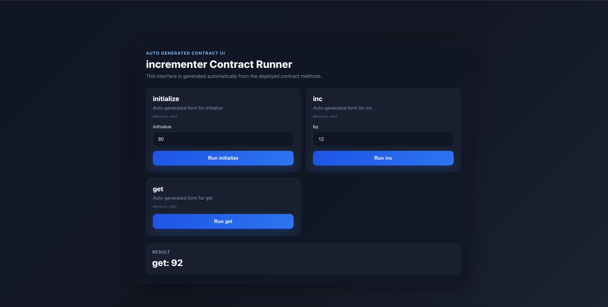
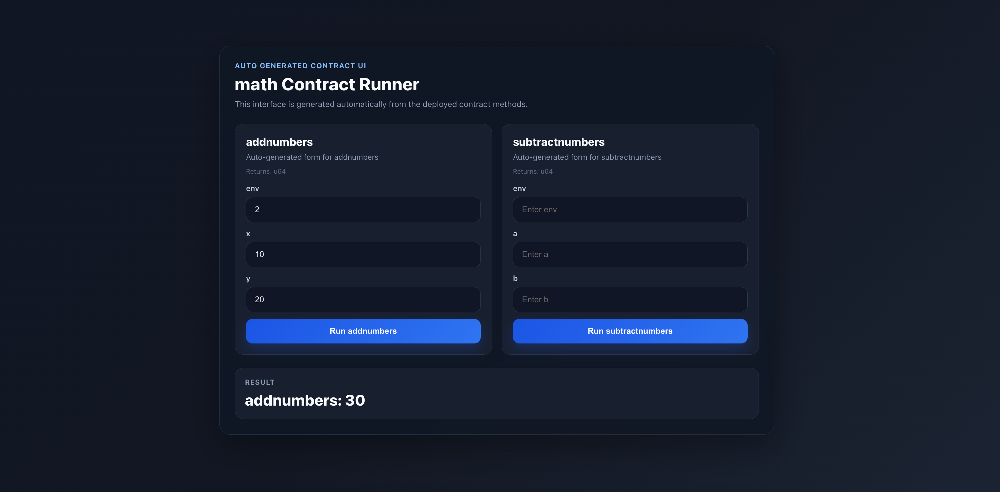
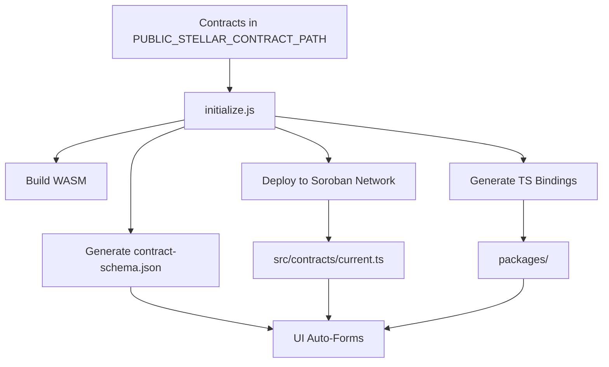

# Soroban Solid Template (Rust Contracts)

This repository is a SolidJS frontend that auto-generates a contract UI from Soroban (Rust) contracts. It builds, deploys, and binds your Rust contracts, then renders a form for each method.

Note: We will create another branch for Solidity contracts. This branch is strictly for Soroban/Rust contracts.

**Features**
- Auto-generated UI forms from contract interface
- One-command build + deploy + binding generation
- TypeScript contract clients and bindings
- Live network targeting via `.env`
- Schema-driven UI rendering (no hardcoded methods)

**Screenshots**
> Add your images here and update the paths.




**Prerequisites**
- Node.js + npm (or pnpm/yarn)
- Rust toolchain
- Stellar CLI (`stellar`) with Soroban support
- Access to a Soroban network (testnet by default)

**Quick Start (pnpm)**
1. Install dependencies
```bash
pnpm install
```
2. Configure `.env`
```bash
PUBLIC_STELLAR_NETWORK="testnet"
PUBLIC_STELLAR_NETWORK_PASSPHRASE="Test SDF Network ; September 2015"
PUBLIC_STELLAR_RPC_URL="https://soroban-testnet.stellar.org"
PUBLIC_STELLAR_ACCOUNT="test1"
PUBLIC_STELLAR_CONTRACT_PATH="../mycontract"
```
3. Initialize + run (single command)
```bash
pnpm run dev
```

**Manual Run (step-by-step)**
```bash
node initialize.js
pnpm run dev
```

**Program Flow**
1. `initialize.js` builds the Rust contracts in `PUBLIC_STELLAR_CONTRACT_PATH`.
2. It deploys each contract to the configured Stellar network and captures the deployed contract IDs.
3. It generates TypeScript bindings for each contract in `packages/<alias>` and installs them into the app.
4. It writes contract clients to `src/contracts/<alias>.ts` and updates `src/contracts/current.ts` to point at the latest deployed contract.
5. It generates `src/generated/contract-schema.json` from the contract interface.
6. The UI in `src/App.tsx` reads `contract-schema.json` to render dynamic forms and uses `src/contracts/current.ts` to call the deployed contract.

**Flow Diagram**


**Why `initialize.js` Is Mandatory**
The frontend has no hardcoded contract methods. It depends on generated artifacts created by `initialize.js`:
- Contract WASM build and deployment (without this there is no live contract to call).
- Generated TypeScript bindings in `packages/*` (without these the client cannot call methods).
- `src/contracts/current.ts` (points the UI at the correct contract ID and network).
- `src/generated/contract-schema.json` (drives the auto-generated form inputs).

If you skip `initialize.js`, the UI won’t know which contract to call or which inputs to render.

**Working With Rust Contracts**
- Put your Soroban Rust contracts inside the directory specified by `PUBLIC_STELLAR_CONTRACT_PATH`.
- When you change contract code, re-run `node initialize.js` to rebuild, redeploy, and regenerate bindings + schema.
- To switch contracts, just redeploy and `initialize.js` will update `src/contracts/current.ts`.

**Important Paths**
- Rust contracts: `PUBLIC_STELLAR_CONTRACT_PATH` in `.env`
- Generated bindings: `packages/<contract-alias>`
- Current contract client: `src/contracts/current.ts`
- Contract UI schema: `src/generated/contract-schema.json`

**Scripts**
- `pnpm run dev`: initialize contracts then start dev server
- `pnpm run build`: production build
- `pnpm run serve`: preview production build
